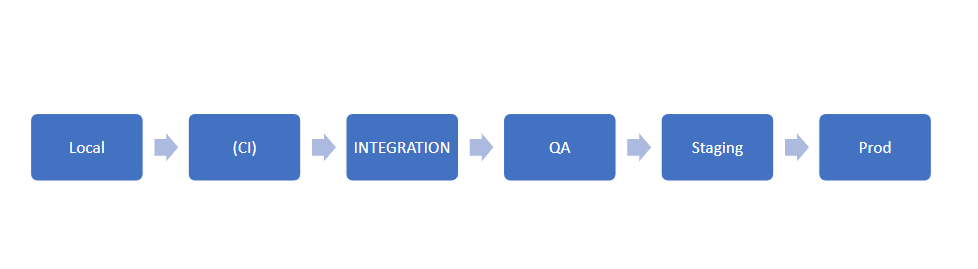
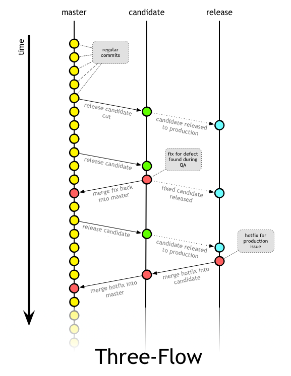
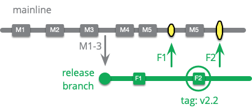
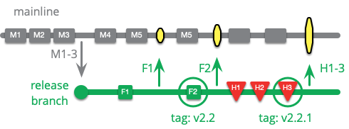
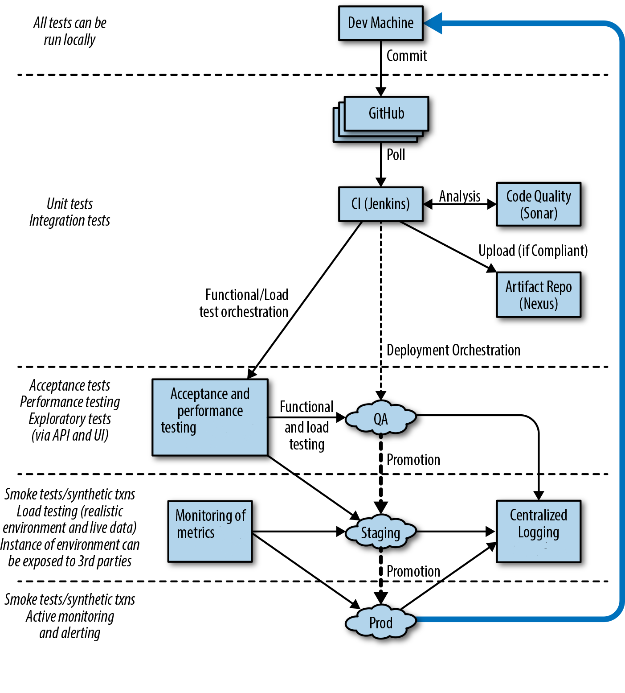

# CI/ CD 
## 1 ***PIPELINE DESCRIPTION***

### **Release schedule variations**
Once in 2-3 month if there are big features.
Once in 1-2 week if it is small features.

### **Enviroments**
Local, CI, Integration, QA, Staging, Prod.

### **Quality gates, testing**
Checking:
- Is the code fully usable for all use cases described in the code requirements
- Do the new automated tests cover the added code enough
- Does the code meet the requirements of the existing styling guidelines
- Working with DB
- Security

Used testing types: unit testing, integration testing, smoke testing, gui testing.
Test coverage must be under 50% and near 90% for module tests
### **Tools for CI/CD**
Source version control - github
CI server - Jenkins
code quality checking - SonarQube
documentation - swagger

## 2 ***Branching strategy***
Choosed branching strategy - Three Flow

In this approach, all developers work in the same master branch. If a feature is trivial, it is simply implemented and added in one commit. If the development of a feature takes some time, then first a flag (disabled by default) is added to activate it. The developer enables this flag locally for developing and testing a new feature, but the code in the main repository still uses the “old” code branches. To add commits to master, rebase is used. If you used a local branch to work on a feature, it should be moved to master, so we won't have any traces of that branch in origin.
- There are three branches: master, candidate, release
- We work in master. All new commits are added using a rebase.
- Features in the development process are disabled by flags. They turn on when they are ready.
When it comes time to make a release candidate, it is made from master by merging (merge with the "--no-ff" key) its commits with the candidate branch

## 3 ***Scenarios decription***
### **Path to production**

### **Hot-fixes**

All hotfixes for production are made on the release branch and then merged into candidate and master
### **Path to another enviroments**

