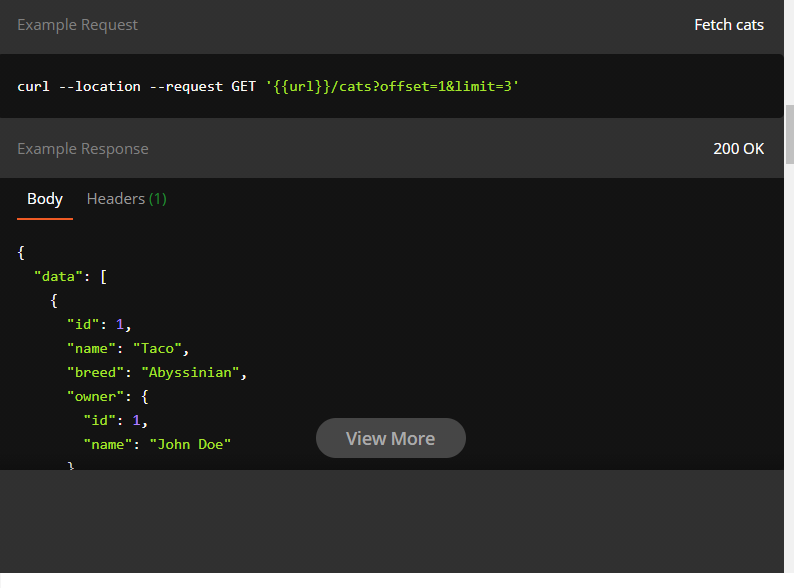
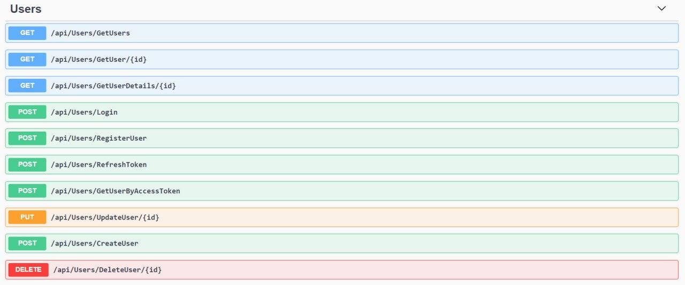

### BookLibrary

## Architecture.Development View
Основні компоненти програми, сервіси, які спілкуються між собою, база даних,протокол роботи HTTP

### API design guideline 
## -Protocol HTTP;
## - Data format JSON
## Methods
Always keep in mind these following points while designing the URL for your resources.

There should be only 2 base URLs per resource. One to fetch the collection; the second one for a specific element in the collection.
Verbs should be kept away from URLs, instead use nouns.
Avoid mixing plurals and singulars for your resource names. Stick to one and keep it consistent for all your APIs
Use concrete names for your resource rather than abstract ones. For e.g, if you are designing an API for blogs and articles, consider exposing /blogs, /articles rather than /items or /assets.

GET Fetch all cats
{{url}}/cats
API to fetch all cats

GET Fetch a particular cat
{{url}}/cats/:id
API to fetch a particular cat by id

Operations MUST use the proper HTTP methods whenever possible, and operation idempotency MUST be respected. HTTP methods are frequently referred to as the HTTP verbs. The terms are synonymous in this context, however, the HTTP specification uses the term method.

Below is a list of methods that REST services should support. Not all resources will support all methods, but all resources using the methods below MUST conform to their usage.
GET - Return the current value of an object
POST - Create a new object based on the data provided, or submit a command
PUT - Replace an object, or create a named object, when applicable
DELETE - Delete an object

## Paginatation

It is almost never a good idea to return all resources of your database at once. Consequently, you should provide a pagination mechanism. A really simple approach is to use the parameters offset and limit, which are well-known from databases.

GET Fetch cats
{{url}}/cats?offset=1&limit=10
API to fetch cats using paginated API. If the client omits the parameter you should use defaults (like offset=0 and limit=10)

Example:

## Filtering

Use a unique query parameter for each field that implements filtering. For example, when requesting a list of tickets from the /cats endpoint, you may want to limit these to only those with color white. This could be accomplished with a request like GET /cats?breed=birman. Here, the breed is a query parameter that implements a filter

GET Filter cats by breed
{{url}}/cats?breed={{breedName}}
API to return cats with the given breed as parameter

Example:

## Sorting

A generic parameter sort can be used to describe sorting rules. Accommodate complex sorting requirements by letting the sort parameter take in a list of comma separated fields, each with a possible unary negative to imply descending sort order.

GET Fetch cats, sorted by name (ascending)
{{url}}/cats?sort=name

Example:

## Status codes

When the client raises a request to the server through an API, the client should know the feedback, whether it failed, passed or the request was wrong. HTTP status codes are a bunch of standardized codes which has various explanations in various scenarios. The server should always return the right status code.

200 OK - Response to a successful GET, PUT, PATCH or DELETE. Can also be used for a POST that doesn't result in a creation.
201 Created - Response to a POST that results in a creation. Should be combined with a Location header pointing to the location of the new resource
400 Bad Request - The request is malformed, such as if the body does not parse
404 Not Found - When a non-existent resource is requested
500 Internal Server Error - This is either a system or application error, and generally indicates that although the client appeared to provide a correct request, something unexpected has gone wrong on the server

## Versioning

Always version your API. Versioning helps you iterate faster and prevents invalid requests from hitting updated endpoints. It also helps smooth over any major API version transitions as you can continue to offer old API versions for a period of time.

There are mixed opinions around whether an API version should be included in the URL or in a header. Academically speaking, it should probably be in a header. However, the version needs to be in the URL to ensure browser explorability of the resources across versions (remember the API requirements specified at the top of this post?).

An API is never going to be completely stable. Change is inevitable. What's important is how that change is managed. Well documented and announced multi-month deprecation schedules can be an acceptable practice for many APIs. It comes down to what is reasonable given the industry and possible consumers of the API.

All API interfaces must provide a major version number, which is encoded at the end of the protobuf package, and included as the first part of the URI path for REST APIs. If an API introduces a breaking change, such as removing or renaming a field, it must increment its API version number to ensure that existing user code does not suddenly break.

Note: The use of the term "major version number" above is taken from semantic versioning. However, unlike in traditional semantic versioning, Google APIs must not expose minor or patch version numbers. For example, Google APIs use v1, not v1.0, v1.1, or v1.4.2. From a user's perspective, major versions are updated in place, and users receive new functionality without migration.
A new major version of an API must not depend on a previous major version of the same API. An API may depend on other APIs, with an expectation that the caller understands the dependency and stability risk associated with those APIs. In this scenario, a stable API version must only depend on stable versions of other APIs.

Different versions of the same API must be able to work at the same time within a single client application for a reasonable transition period. This time period allows the client to transition smoothly to the newer version. An older version must go through a reasonable, well-communicated deprecation period before being shut down.

## HTTP mapping
For custom methods, they should use the following generic HTTP mapping:

https://service.name/v1/some/resource/name:customVerb

The reason to use : instead of / to separate the custom verb from the resource name is to support arbitrary paths. For example, undelete a file can map to POST /files/a/long/file/name:undelete

The following guidelines shall be applied when choosing the HTTP mapping:

Custom methods should use HTTP POST verb since it has the most flexible semantics, except for methods serving as an alternative get or list which may use GET when possible. (See third bullet for specifics.)
Custom methods should not use HTTP PATCH, but may use other HTTP verbs. In such cases, the methods must follow the standard HTTP semantics for that verb.
Notably, custom methods using HTTP GET must be idempotent and have no side effects. For example custom methods that implement special views on the resource should use HTTP GET.
The request message field(s) receiving the resource name of the resource or collection with which the custom method is associated should map to the URL path.
The URL path must end with a suffix consisting of a colon followed by the custom verb.
If the HTTP verb used for the custom method allows an HTTP request body (this applies to POST, PUT, PATCH, or a custom HTTP verb), the HTTP configuration of that custom method must use the body: "*" clause and all remaining request message fields shall map to the HTTP request body.
If the HTTP verb used for the custom method does not accept an HTTP request body (GET, DELETE), the HTTP configuration of such method must not use the body clause at all, and all remaining request message fields shall map to the URL query parameters.

## Swagger file screenshots

