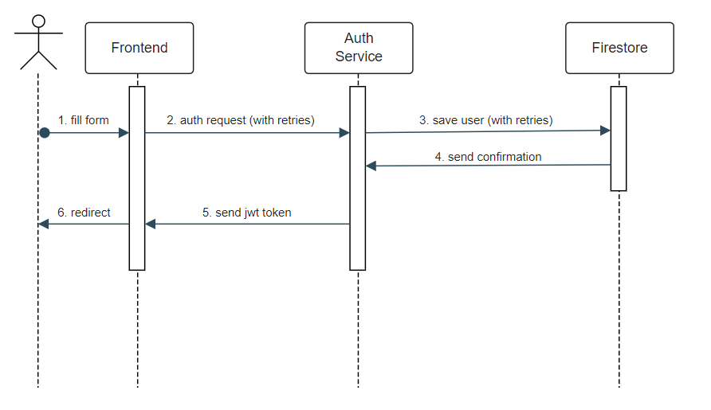
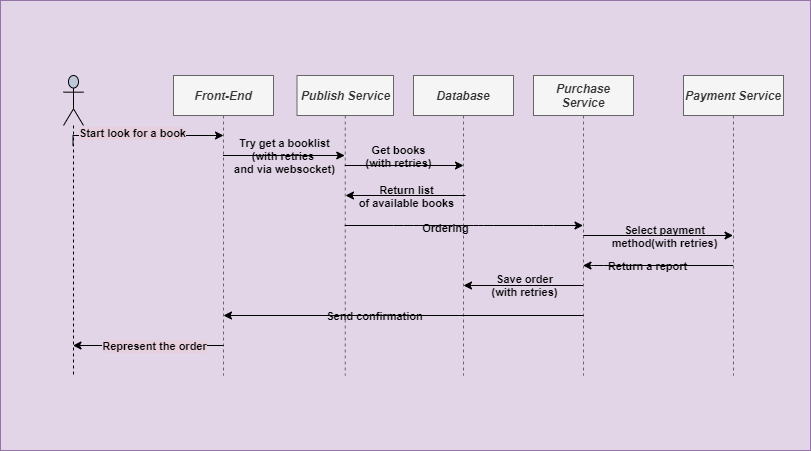

# Possible system failures

## 1. Inter-Service communication errors

***Service Fails to communicate to Database (Firestore/Postgres)*** - in runtime, when processing requests application will fail to query the database. Desired behaviour: if application cannot establish a connection to the database at start up, it should log an error and exit. This way, possible misconfiguration can be noticed early on and rollout is prevented by Kubernetes.
Desired behaviour 2: If connection is lost during runtime, then healthcheck should fail and Kubernetes will restart containers. Clients should follow internal server error flow.

***Auth service fails to save newly created user to Firestore*** - Desired behaviour: we should retry writing the document 5 times with a delay of 1 second. Each attempt should be logged and written to metrics. If all attempts fail, we should send internal server error back to the client.

***Authors service fails to communicate to publish service*** - Desired behaviour: we should retry request up to 5 times with an exponentially increasing delay (2 - 30 seconds) . If publish service produces a lot of errors in general, we should block percentage of new requests to upload service with "Service Unavailable" response.
Desired behaviour 2: client gets a notification about error and has to try upload page again later.

***User service fails to communicate to one or multiple targets*** for more than 1 hour - write to log and alert.

## 2. Client-Server Communication

***Request to auth fails due to internet connectivity issues*** - we should retry one time after 2 seconds and if the issue persists, we should notify a user with an error message.

***Request to booklib api fails due to internet connectivity issues*** - we should retry requests indefinitely every 30 seconds until connection is restored.

***User upload fails (due to internet connectivity issues)*** - we should place file back into upload queue and retry immediately. If we fail 5 times in a row, we should stop attempts and notify user that uppload for this particular file has failed.

***Publish service fails to provide books to order (not found)*** - we should set the books field in the database as unknown. And, possibly, send a notification to the user (this will be determined later based on how of this will be the case).

***Payment service fails in the process of ordering*** -we show message about error with payment.
Desired behaviour: client waits 5-10 minutes and try to pay for again.
Desired behaviour 2: client waits 5-10 minutes and try to pay for again. If it doesn't work, client has to choose another payment way.

## 3. Front-End

***User accesses frontend using unsupported browser or has javascript disabled*** - unsupported browsers can be detected on server side using User Agent header. If browser is not supported anymore, NGINX should serve a special page with upgrade instructions. If user has javascript enabled, we should show notice that js is required using noscript html tag.

***User accesses page which does not exist*** - we show 404 page and log and meter this access attempt.

***Basket download fails (due to connectivity or internal server error)*** - we should retry one time and if we fail again, we should show a notification to the user and client has to try again in 3-5 minutes.

***Any request fails due to internal server error*** - Desired behaviour: we should retry once immediately, and if it fails, we should show notification to the user and cancel the action. 
Desired behaviour 2: if action is syncable (like adding book to the basket), we should keep trying in background every 1 minute for 10 minutes. If we do not succeed, this action should be reverted.

## Flows.

